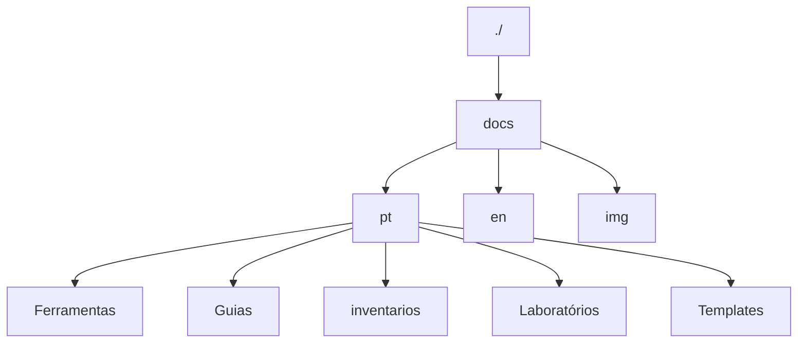

# Contribute

Contribution Text

## :material-tools: Tools

This project was developed with the following tools:

* [poetry](https://python-poetry.org/) for dependency management
* [taskpy](https://github.com/taskipy/taskipy) for task automation
* [mkdocs](https://www.mkdocs.org/) for documentation
* [mkdocs-material](https://squidfunk.github.io/mkdocs-material/) for documentation theme
* [commitizen](https://commitizen-tools.github.io/commitizen/) for commit message standardization

## :fontawesome-solid-user-gear: How to Contribute

First of all, thank you for being part of this project! Your help is very welcome.

To contribute to the project, follow the steps below:

1. Clone the repository to your local machine:

```bash
git clone https://git.rnp.br/gci/dev/inovacao-ciberinfraestrutura/docs.git
```

2. Install the project dependencies:

First, install pipx to install poetry documentation [here](https://pypa.github.io/pipx/)

Now, install poetry, which is the project's dependency manager:

```bash
pipx install poetry
```

Now, inside the project folder, install the project dependencies:

```bash
poetry install
```

Done, now you have all the project dependencies installed.

## Folder Structure

The project is organized as follows:



where each folder has the following function:

- `docs`: contains the project documentation, written in Markdown.
- `pt`: contains the documentation in Portuguese.
- `en`: contains the documentation in English.
- `img`: contains the images used in the documentation.
- `Ferramentas`: contains the tools that have been tested and documented in the laboratories.
- `Guias`: contains the configuration guides for the laboratories and more specific uses of the laboratories.
- `inventarios`: contains the inventories of the laboratories in the netbox import format.
- `Laboratórios`: contains the laboratories that have been tested and documented for network topologies.
- `Templates`: contains the netreplica templates for vendors not yet supported by default.

### :simple-googledocs: docs

The project documentation is written in Markdown and is located in the docs folder. To contribute,
edit existing Markdown files or create new ones, following the established folder and file structure.
Each file should include a title and a description, making it a page of the documentation.

The folder structure should follow the pattern of the corresponding section name,
with an index.md file for the section's home page. The other necessary pages should also be in Markdown.
The site organization is done automatically by MkDocs.

Example:

``` bash
docs/
    ├── Seção/
    │   ├── index.md
```

## Get Started

Now that you have the dependencies installed and understand how it works, you can start contributing to the code,
below are some tips for contributing to the project as well as using the project's automation and standardization tools.

!!! info "Tip"
    Before you start editing the code, it is important to enter the poetry virtual environment, to do this, execute the following command:

!!! warning "Attention"
    After the poetry update from 2025, the `poetry shell` command was moved to a plugin, to work, run the following command:
    ```bash
    poetry self add poetry-plugin-shell
    ```

```bash
poetry shell
```

### :material-tools: Tools

the project has some automation and standardization tools, such as `taskpy` and `black`, which are used to automate tasks and standardize the code, respectively.
#### :material-translate: Automatic Translation

The `task translate` command is responsible for translating the Markdown files located in the `docs/pt` folder to **English** and saving the translations in `docs/en` using the **Gemini 2.0 Flash** model to perform the translation. It ensures that the content is translated accurately without changing the structure of the documentation and keeping all references and links intact.

#### :material-code-tags-check: How to configure and use file translation

The following are instructions for correctly configuring the environment and performing the translations.

---

#### **Step 1: Obtain the Gemini API key**

To use the **Gemini** translation model, you must obtain a free API key. Follow the steps below:

1. Access <a target="_blank" href="https://aistudio.google.com/apikey">Google AI Studio</a>.
2. Log in to a valid Google account.
3. Click on **Create API key**.
4. Copy the generated key to use in the project.

!!! info "Info"
    More about the Google Gemini API implementation can be found in the <a target="_blank" href="https://ai.google.dev/gemini-api/docs/get-started/tutorial?lang=python">Official Documentation</a>.

---

#### **Step 2: Configure the `.env` file**

In the project directory, you will find a file called `.env.example`. It will serve as a template to create your `.env` file containing sensitive settings, such as the API key.

1. Make a copy of the `.env.example` file and rename it to `.env`:

```bash
cp .env.example .env
```

2. Open the `.env` file in any text editor and enter the Gemini key:

```
GEMINI_API_KEY=your-key-here
```

Replace `your-key-here` with the key obtained in Step 1.

---

#### **Step 3: Run the translation**

After configuring the API key in the `.env` file, simply run the command below to start the translation:

```bash
task translate
```

This command will:
- Translate all Markdown files (.md) found in `docs/pt`.
- Create and save the translations in the `docs/en` folder, maintaining the directory structure identical to the source folder.

!!! warning "Note"
    The command will ignore files that are already translated and have not been changed.

---

!!! info "Attention"
    - The command **does not currently translate folder names**. Only the content of the files will be translated.
    - All links and internal references in the documentation will be maintained correctly, without unwanted changes.

---

#### **Additional functionality: Change detection**

The script checks if there have been modifications to the original files before performing a new translation. This ensures that:

* Only files that **have not been translated** or that **have been changed** will have the translation updated.
* Already translated files will remain unchanged if there is no need for translation.

---

!!! info "About the translation"
    The translation uses the **Gemini 2.0 Flash** model, which performs highly accurate and reliable translation. However, as automatic models are subject to error depending on the context, a final review of the translated content is always recommended.

---

#### **Tips for contributing to the translation**

- Edit the original files (in `docs/pt`) whenever you make changes to the documentation.
- After making changes, run the `task translate` command again to update the translated content in English.

With this, the translation of your documentation will always be synchronized with the original language.

#### :material-code-tags-check: Documentation

The project documentation is written in Markdown and is located in the docs folder, following the existing folder, subfolder and file structure.
where all the standardization is recommended by [mkdocs](https://www.mkdocs.org/) and [mkdocs-material](https://squidfunk.github.io/mkdocs-material/), so to view the documentation locally, run the following command:

```bash
task docs
```

!!! info "Tip"
    To contribute to the documentation, you can edit the Markdown files directly or create new files as needed, following the existing folder, subfolder and file structure.

!!! info "Tip"
    You can use any feature available in mkdocs for customizations, to learn more, access the documentation below:

Useful links:

- <a taget="_blank" href="https://squidfunk.github.io/mkdocs-material/reference/admonitions/">mkdocs-admonitions</a>: documentation for the admonitions (documentation annotations)
- <a taget="_blank" href="https://squidfunk.github.io/mkdocs-material/reference/icons-emojis/#search">mkdocs-emojis</a> : documentation for the emojis
- <a taget="_blank" href="https://mermaid.js.org/syntax/flowchart.html">mermaid</a> : documentation for the mermaid (flow diagram in markdown)

#### Commits :material-code-tags-check:

The project uses `commitizen` to standardize commit messages. To create a commit, run the following command:

!!! Warning "Note"
    You must be inside the poetry virtual environment, if not, run the following command:
     ```bash
     poetry shell
     ```

```bash
task commit
```

Now just fill in the requested information and the commit will be made in a standardized way. After the commit, you can push to the remote repository.

## I didn't find what I need here

If you haven't found what you need, you can open an [issue in the project](https://git.rnp.br/redes-abertas/docs/-/issues) reporting what you can't do or what needs to be better documented

## Continuous improvement

This document can be improved by anyone who has an interest in improving it. So, feel free to provide more tips to people who also want to contribute :heart: