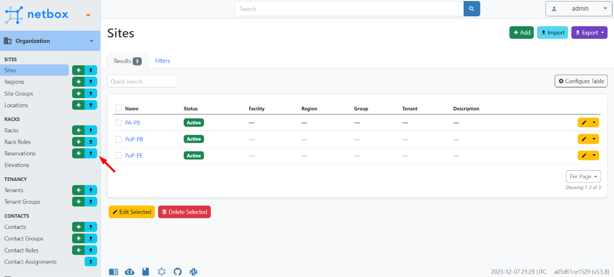

# Netbox

# Netbox Installation and Imports

## 1. Installation

To install NetBox using Docker, follow the steps below:

1.  Make sure you have Docker and Docker Compose installed on your machine. If you don't already have them, you can find them at the following links:
    *   Docker: [https://docs.docker.com/get-docker/](https://docs.docker.com/get-docker/)
    *   Docker Compose: [https://docs.docker.com/compose/install/](https://docs.docker.com/compose/install/)
2.  Clone the official NetBox Docker Compose repository from GitHub:

    ```
    git clone <https://github.com/netbox-community/netbox-docker.git>
    ```

3.  Access the cloned directory:

    ```
    cd netbox-docker
    ```

4.  Access the environment file `.env` from the provided example:

    ```
    cd env
    ```

5.  Edit the `.env` file to adjust the settings as needed. Specifically, you can change the database credentials, passwords, email settings, etc., according to your preferences and requirements. By default, it comes fully configured for quick execution, but it is highly recommended to change such information if you want to put it into production.
6.  If you want to change the NetBox version, edit it in the compose file, in the image version section.
    **Obs.**: Changes between distant versions may cause errors. Look for the correct versions at [https://github.com/netbox-community/netbox-docker/releases](https://github.com/netbox-community/netbox-docker/releases)
7.  Build and run the Docker containers:

    ```
    tee docker-compose.override.yml <<EOF
    version: '3.4'
    services:
      netbox:
        ports:
          - 8000:8080
    EOF
    docker compose pull
    docker compose up
    docker compose exec netbox /opt/netbox/netbox/manage.py createsuperuser
    ```

    **Note:** The communication port used may differ from port 8000 if another active application is using this port. In this case, check for another available port (for example: 8080 or 8081) and don't forget to replace it appropriately in the following steps.

8.  Wait until the containers are built and initialized.
9.  Open your web browser and go to: **[http://localhost:8000/](http://localhost:8000/)**.

    **Note:** If you want to access NetBox from a different machine, replace "localhost" with the IP address of the machine where Docker is running.

10. You will be prompted to set the administrator password.
11. To create the administration user, run the following command in the terminal after the containers have been initialized:

    ```bash
    bashCopy code
    docker-compose exec <netbox container name> /opt/netbox/netbox/manage.py createsuperuser
    ```

## 2. Access

After completing the NetBox installation in Docker, you can access it via a web browser. By default, NetBox will be available locally at [http://localhost:8000/](http://localhost:8000/). However, if you want to access NetBox securely through an SSH tunnel, follow the steps below:

### 2.1 Access via SSH Tunnel

1. Now, to access NetBox securely through an SSH tunnel, you will need a remote server with SSH access, where Docker does not need to be installed.
2. On the remote server, execute the following command to create an SSH tunnel to NetBox:

    ```
    ssh -N -L 8080:localhost:8080 user@server_address
    ```

    *   Replace `user` with the username of the remote server.
    *   Replace `server_address` with the IP address or domain name of the remote server.
3. After entering your SSH password, the tunnel will be established. Now, the remote server will redirect requests from port 8080 to NetBox on port 8000.
4. On your local computer, open your web browser and go to:

    ```
    <http://localhost:8080/>
    ```

    You will be redirected to the NetBox that is running on the remote server through the SSH tunnel. Now you can access NetBox securely.

Remember that the SSH tunnel will keep the connection active while the remote server terminal is open. If you want to keep the tunnel running in the background, add the `-f` option to the SSH command in step 9:

```
ssh -f -N -L 8080:localhost:8000 user@server_address
```

With this, you can access NetBox securely through an SSH tunnel, ensuring the protection of your data during transmission.

## 3. Import

For the import, the files must be organized in a correctly formatted CSV format, containing the fields indicated below. In addition, it is important that the import follows the order of the file numbering as stated in the data preparation.

### 3.1. Data Preparation

The import of CSV files must follow the established numbering and contain the indicated information. The names (**in bold**) indicate the import locations, and the information below (*in italics*) indicates the fields required for import.

1.  **manufacturers**
    *name, slug*
2.  **platforms**
    *name, slug, manufacturer, napalm\_driver, description*

    **tags**
    *name, items, slug, color, description*

3.  **device\_roles**
    *name, color, vm\_role, description, slug, tag*

    **device\_types**
    *model, manufacturer, part\_number, u\_height, is\_full\_depth, slug*

    **sites**
    *name, status, slug, latitude, longitude*

    **tenants**
    *name, slug*

4.  **devices**
    *name, status, device\_role, manufacturer, device\_type, site, platform, tag*
5.  **interfaces**
    *name, device, label, enabled, type, description*

    **VRFs**
    *name, rd, tenant, enforce\_unique, description, import\_targets, export\_targets, comments, tags*

6.  **circuit\_types**
    *name, slug*

    **IP\_addresses**
    *address, vrf, tenant, status, role, device, interface, dns\_name, description*

    **providers**
    *name, slug*

7.  **circuits**
    *cid, provider, type, status, tenant, description*

### 3.2. Import

1.  **Log in as superuser**: Access NetBox with the admin credentials.
2.  **Find the import option**: Check the section related to the data you want to import, and look for an import **icon** as we see in Figure 1 below:

    
    **Figure 1**: Clicking on the import icon allows you to upload the CSV file.

3.  **Select the CSV file**: Upload the CSV file with the prepared data. Each CSV must contain the fields as described in Subsection 3.1.
4.  **Start the import**: Click "Submit" or "Import" to start the process.
5.  **Check the results**: Analyze the import report to confirm success.

<aside>
💡 **Note:** After importing the files from item `7.`, it is necessary to include the terminations manually.
To do this, follow the instructions below to complete the configuration. Click on the created circuit and the `edit` icon as highlighted in the image below.
Then edit the `side*` and `interface*` information.
</aside>

*   Click on Circuits to see the circuits created in step 7. Select one of the created Circuit IDs with 1 click, as indicated in Figure 2.

    **Note**: The steps must be done for every existing Circuit ID.


**Figure 2**: click on the circuit (arrow on the left), then select the Circuit ID (highlighted and indicated with the arrow) to perform the configuration.

*   After clicking on one of the circuits, the circuit settings are similar to those shown in Figure 3. The terminations must be edited by clicking on the `Edit` icon as highlighted in the image below. When you click on the icon, NetBox forwards you to the Cables part in Connections, as shown in Figure 4.


**Figure 3:** screen of a Circuit ID. The edits of each Termination must be done by clicking on `Edit` (highlighted with the arrow).

*   Figure 4 presents the creation of the connection cables, the numbering of the cables only follows the order of creation. The `Side*` and `Interface*` items must be filled in to complete the configuration of step 7.


**Figure 4:** configuration screen of the connection cables for the connection between the devices.

<aside>
💡 Remember to adapt the subcategories and import locations according to the specific functionalities of your NetBox. Each category may have unique fields and settings for import.
</aside>