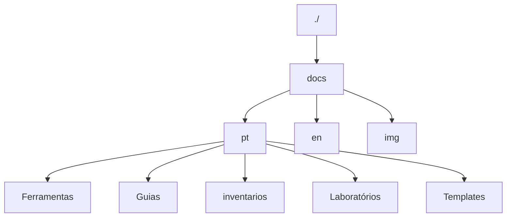

# Contribua

## :material-tools: Ferramentas

Este projeto foi desenvolvido com as seguintes ferramentas:

* [poetry](https://python-poetry.org/) para gerenciamento de dependências
* [taskpy](https://github.com/taskipy/taskipy) para automação de tarefas
* [mkdocs](https://www.mkdocs.org/) para documentação
* [mkdocs-material](https://squidfunk.github.io/mkdocs-material/) para tema de documentação
* [commitizen](https://commitizen-tools.github.io/commitizen/) para padronização de mensagens de commit


## :fontawesome-solid-user-gear: Como contribuir

Primeiramente, obrigado por fazer parte deste projeto! Sua ajuda é muito bem-vinda.

Para contribuir com o projeto, siga as etapas abaixo:

1. clone o repositório para sua máquina local:


```bash
git clone https://git.rnp.br/redes-abertas/docs.git
```

2. Instale as dependências do projeto:

primeiramente, instale o pipx para instalar o poetry docemtação [aqui](https://pypa.github.io/pipx/)

Agora, instale o poetry, que é o gerenciador de dependências do projeto:

```bash
pipx install poetry
```

agora dentro da pasta do projeto, instale as dependências do projeto:

```bash
poetry install
```

pronto, agora você tem todas as dependências do projeto instaladas.


## Estrutura de pastas

O projeto é organizado da seguinte forma:



onde cada pasta tem a seguinte função:

- `docs`: contém a documentação do projeto, escrita em Markdown.
- `pt`: contém a documentação em português.
- `en`: contém a documentação em inglês.
- `img`: contém as imagens usadas na documentação.
- `Ferramentas`: contém as ferramentas que foram testadas e documentadas nos laboratórios.
- `Guias`: contém as guias de configuração dos laboratórios e ultilizações mais específicas do laboratórios
- `inventarios`: contém os inventários dos laboratorios no formato de importação do netbox.
- `Laboratórios`: contém os laboratórios que foram testados e documentados de topologias de redes.
- `Templates`: contém os templates do netreplica para vendors ainda não suportados por padrão.

### :simple-googledocs: docs

A documentação do projeto é escrita em Markdown e está localizada na pasta docs. Para contribuir, 
edite os arquivos Markdown existentes ou crie novos, seguindo a estrutura de pastas e arquivos já estabelecida. 
Cada arquivo deve incluir um título e uma descrição, tornando-o uma página da documentação.

A estrutura de pastas deve seguir o padrão do nome da seção correspondente, 
com um arquivo index.md para a página inicial da seção. As demais páginas necessárias também devem ser em Markdown. 
A organização do site é feita automaticamente pelo MkDocs.

Exmplo:

``` bash
docs/
    ├── Seção/
    │   ├── index.md
```

## Mão na massa

Agora que você já tem as dependências instaladas e entendeu como o poetry funciona, você pode começar a contribuir com o código,
a seguir algumas dicas para contribuir com o projeto assim como ultilizar as ferramentas de automação e padronização do projeto.

!!! info "Dica"
    antes de começar a editar o código, é importante entrar no ambiente virtual do poetry, para isso, execute o seguinte comando:

!!! warning "Atenção"
    Após a atualização do poetry de 2025, o comando `poetry shell` foi transferido para um plugin, para funcionar, execute o seguinte comando:
    ```bash
    poetry self add poetry-plugin-shell
    ```

```bash
poetry shell
```

### :material-tools: Ferramentas

o projeto conta com algumas ferramentas de automação e padronização, como o `taskpy` e o `black`, que são usadas para automatizar tarefas e padronizar o código, respectivamente.
#### :material-translate: Tradução Automatica

O comando `task translate` é responsável por traduzir os arquivos Markdown localizados na pasta `docs/pt` para o idioma **inglês** e salvar as traduções em `docs/en` ultilizando o modelo **Gemini 2.0 Flash** para realizar a tradução. Ele garante que o conteúdo seja traduzido de forma precisa sem alterar a estrutura da documentação e mantendo todas as referências e links intactos.


#### :material-code-tags-check: Como configurar e utilizar a tradução de arquivos

A seguir estão as instruções para configurar corretamente o ambiente e realizar as traduções.

---

#### **Passo 1: Obter a chave da API do Gemini**

Para utilizar o modelo de tradução do **Gemini**, é necessário obter uma chave de API gratuita. Siga as etapas abaixo:

1. Acesse o <a target="_blank" href="https://aistudio.google.com/apikey">Google AI Studio</a>.
2. Logue em uma conta google valida.
3. Clique em **Criar chave API**.
4. Copie a chave gerada para usar no projeto.


!!! info "Info"
    Mais sobre a implementação o google gemini API acesse a <a target="_blank" href="https://ai.google.dev/gemini-api/docs/get-started/tutorial?lang=python">Documentação Oficial</a>.

---

#### **Passo 2: Configurar o arquivo `.env`**

No diretório do projeto, você encontrará um arquivo chamado `.env.example`. Ele servirá como um modelo para criar seu arquivo `.env` contendo as configurações sensíveis, como a chave de API.

1. Faça uma cópia do arquivo `.env.example` e renomeie-a para `.env`:

```bash
cp .env.example .env
```

2. Abra o arquivo `.env` em qualquer editor de texto e insira a chave do Gemini:

```
GEMINI_API_KEY=sua-chave-aqui
```

Substitua `sua-chave-aqui` pela chave obtida no Passo 1.

---

#### **Passo 3: Executar a tradução**

Após configurar a chave de API no arquivo `.env`, basta executar o comando abaixo para iniciar a tradução:

```bash
task translate
```

Este comando irá:
- Traduzir todos os arquivos Markdown (.md) encontrados em `docs/pt`.
- Criar e salvar as traduções na pasta `docs/en`, mantendo a estrutura de diretórios idêntica à da pasta de origem.

!!! warning "Observação"
    O comando irá ignorar os arquivos que já estiverem traduzidos e não foram alterados.

---

!!! info "Atenção"
    - O comando **não traduz os nomes das pastas atualmente**. Somente o conteúdo dos arquivos será traduzido.
    - Todos os links e referências internas na documentação serão mantidos corretamente, sem alterações indesejadas.

---

#### **Funcionalidade adicional: Detecção de mudanças**

O script verifica se houve modificações nos arquivos originais antes de realizar uma nova tradução. Isso garante que:

* Apenas arquivos que **não foram traduzidos** ou que **foram alterados** terão a tradução atualizada.
* Arquivos já traduzidos permanecerão inalterados caso não exista necessidade de tradução.

---

!!! info "Sobre a tradução"
    A tradução utiliza o modelo **Gemini 2.0 Flash**, que realiza tradução altamente precisa e confiável. No entanto, como modelos automáticos estão sujeitos a erro dependendo do contexto, é sempre recomendada uma revisão final do conteúdo traduzido.

---

#### **Dicas para contribuir com a tradução**

- Edite os arquivos originais (em `docs/pt`) sempre que for realizar alterações na documentação.
- Após realizar alterações, execute novamente o comando `task translate` para atualizar o conteúdo traduzido em inglês.

Com isso, a tradução da sua documentação estará sempre sincronizada com o idioma original.

#### :material-code-tags-check: Documentação

A documentação do projeto é escrita em Markdown e está localizada na pasta docs, seguindo a estrutura de pastas, subpastas e arquivos existentes.
onde toda a padronização e a recomendada pelo [mkdocs](https://www.mkdocs.org/) e [mkdocs-material](https://squidfunk.github.io/mkdocs-material/), logo para visualizar a documentação localmente, execute o seguinte comando:

```bash
task docs
```

!!! info "Dica"
    Para contribuir com a documentação, você pode editar os arquivos Markdown diretamente ou criar novos arquivos conforme necessário, seguindo a estrutura de pastas, subpastas e arquivos existentes.

!!! info "Dica"
    Você pode ultilizar qualquer feature disponivel no mkdocs de personalizações, para saber mais acesse a documentação abaixo:

links uteis:

- <a taget="_blank" href="https://squidfunk.github.io/mkdocs-material/reference/admonitions/">mkdocs-admonitions</a>: documentação para as admonitions(anotações de documentação)
- <a taget="_blank" href="https://squidfunk.github.io/mkdocs-material/reference/icons-emojis/#search">mkdocs-emojis</a> : documentação para os emojis
- <a taget="_blank" href="https://mermaid.js.org/syntax/flowchart.html">mermaid</a> : documentação para o mermaid(diagrama de fluxo em markdown)


#### Commits :material-code-tags-check:

O projeto utiliza o `commitizen` para padronizar as mensagens de commit. Para criar um commit, execute o seguinte comando:

!!! Warning "Observação"
    você deve esta dentro do ambiente virtual do poetry, se não, execute o seguinte comando:
     ```bash
     poetry shell
     ```

```bash
task commit
```

Agora é só preencher as informações solicitadas e o commit será feito de forma padronizada. Após o commit, você pode fazer o push para o repositório remoto.

## Não achei o que preciso aqui

Caso não tenha encontrado o que precisa, você pode abrir uma [issue no projeto](https://git.rnp.br/redes-abertas/docs/-/issues) relatando o que não consegue fazer ou o que precisa ser melhor documentado

## Melhoria contínua

Esse documento pode ser melhorado por qualquer pessoa que tenha interesse em melhora-lo. Então, sinta-se a vontade para fornecer mais dicas as pessoas que desejam contribuir também :heart:


