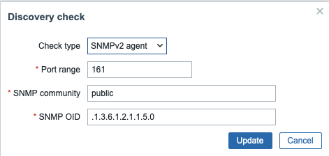
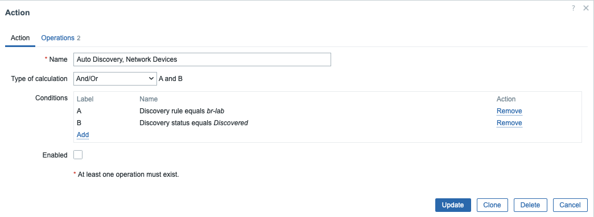
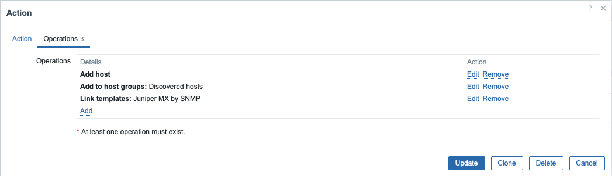

# Auto Discovery no Zabbix

## :octicons-book-24: 1. Introdução

O **Auto Discovery** (descoberta automática) do Zabbix é um recurso avançado que permite detectar dinamicamente hosts e serviços em uma rede, eliminando a necessidade de cadastrar dispositivos manualmente. Essa funcionalidade é especialmente útil em ambientes dinâmicos, como o laboratório **br-lab**, onde novos dispositivos podem ser adicionados frequentemente.

Neste guia, você aprenderá a configurar uma regra de descoberta no Zabbix para identificar automaticamente ativos da rede utilizando o protocolo **SNMPv2**, além de criar uma **ação de cadastro automático** para adicionar os dispositivos descobertos ao monitoramento.

---

## :octicons-tools-24: 2. Pré-requisitos

Antes de iniciar, verifique os seguintes pré-requisitos:

1. **Zabbix devidamente instalado** na rede `br-lab`.
   Caso ainda não tenha feito a instalação, siga o [Guia de Instalação do Zabbix](../../../pt/Ferramentas/Zabbix/index.md).

2. A rede `br-lab` deve estar funcional e com dispositivos configurados para responder a requisições SNMPv2.

3. O usuário utilizado deve ter permissões administrativas no frontend do Zabbix.

---

## :octicons-checklist-24: 3. Configurando a Descoberta Automática

A descoberta automática no Zabbix funciona com base em duas entidades:

* **Regra de Descoberta** (*Discovery Rule*): Define a faixa de IPs a ser escaneada, o tipo de verificação (ex: SNMP, ICMP), e como extrair o nome do host.
* **Ação de Cadastro** (*Discovery Action*): Aplica regras após a detecção (ex: adicionar ao monitoramento, aplicar template, mover para grupo).

---

## :octicons-tools-24: 3.1 Criando a Regra de Descoberta

Para criar uma nova regra:

1. Acesse o **Zabbix Frontend** e vá para:
   `Data Collection → Discovery`
   Clique em **Create discovery rule**.

2. Configure os seguintes parâmetros:

| Campo                          | Valor                               |
| ------------------------------ | ----------------------------------- |
| **Name**                       | `br-lab`                            |
| **Discovery by proxy**         | `Zabbix server`                     |
| **IP range**                   | `172.10.10.1-254`                   |
| **Update interval**            | `1m`                                |
| **Device uniqueness criteria** | `IP address`                        |
| **Host name**                  | `SNMPv2 agent ".1.3.6.1.2.1.1.5.0"` |
| **Visible name**               | `SNMPv2 agent ".1.3.6.1.2.1.1.5.0"` |

3. Adicione um **Check** com os seguintes parâmetros:

| Campo          | Valor                                        |
| -------------- | -------------------------------------------- |
| **Check type** | `SNMPv2 agent`                               |
| **Community**  | `public`                                     |
| **Port**       | `161`                                        |
| **SNMP OID**   | `.1.3.6.1.2.1.1.5.0` (Nome do host via SNMP) |

4. Salve a regra após a configuração.

> ✅ Ao configurar corretamente, a regra varrerá toda a sub-rede `172.10.10.0/24` a cada minuto, buscando dispositivos que respondem a SNMP na porta 161 com a comunity `public`.

---

### :material-image: Imagens de Referência (exemplo)

#### 📸 Configuração Geral da Regra:
---

#### 📸 Configuração dos Checks SNMP:
---
  
---

Claro! Aqui está o trecho aprimorado no estilo acadêmico e técnico, com formatação clara, explicações completas e a inclusão da seção de imagens de exemplo para facilitar o entendimento visual:

!!! info "Nota"
    lembre-se de ativar a regra para que ela funcione corretamente. Você pode fazer isso na aba de configuração da regra de descoberta, marcando a opção "Enable".
---

## :octicons-gear-24: 3.2 Criando a Ação de Cadastro Automático

### 🧠 O que é uma *Discovery Action*?

A **ação de descoberta** no Zabbix é um conjunto de instruções que definem **o que deve ser feito automaticamente após a detecção de um host** por uma *Discovery Rule*. Esse mecanismo permite a automação do gerenciamento de infraestrutura, evitando o cadastro manual de dispositivos.

Com uma ação de descoberta configurada, é possível:

* Inserir o host detectado automaticamente no banco de monitoramento;
* Associar o host a um ou mais **grupos de hosts**;
* **Aplicar templates de monitoramento** (ex: ICMP, SNMP, sistemas operacionais);
* Marcar campos do inventário e ativar o host para monitoramento imediato.

---

### 🔧 Etapas para Criar a Ação

1. No **Zabbix Frontend**, navegue até:
   `Alerts → Actions → Discovery actions`.

2. Clique em **Create action** e configure conforme abaixo:

---

#### 🧩 Aba "Action"

| Campo          | Valor                                                                                         |
| -------------- |-----------------------------------------------------------------------------------------------|
| **Name**       | `Auto Discovery: Network Devices`                                                             |
| **Conditions** | <ul><li>`Discovery rule equals br-lab`</li><li>`Discovery status equals Discovered`</li></ul> |

> 💡 Essas condições garantem que a ação será executada apenas para hosts descobertos com sucesso pela regra `br-lab`.

---

#### ⚙️ Aba "Operations"

Adicione as seguintes operações:

| Tipo de Operação             | Parâmetros                                                    |
| ---------------------------- | ------------------------------------------------------------- |
| **Add host**                 | Adiciona automaticamente o host descoberto ao banco do Zabbix |
| **Add to host groups**       | `Discovered hosts`                                            |
| **Link to templates**        | `Juniper MX by SNMP`                                          |

!!! info "Info"
    O template `Juniper MX by SNMP` está localizado dentro do grupo `Templates/Network Devices`. Ele é ideal para monitorar equipamentos Juniper da linha MX via SNMP.
    Caso você utilize outros dispositivos de rede (Cisco, Mikrotik, Dell, etc.), escolha um template apropriado ou crie um personalizado conforme suas necessidades.

---

### :material-image: Imagens de Exemplo

#### 📸 Tela da aba "Action"

#### 📸 Tela da aba "Operations"

---

Com essa ação configurada, todo dispositivo detectado na rede `br-lab` com suporte SNMP será adicionado automaticamente ao Zabbix, com template e grupo de monitoramento definidos, permitindo escalabilidade e agilidade na gestão de infraestrutura.

