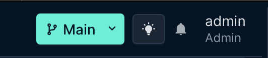

# :material-power-plug-outline: Branching Plugin

O plugin Branching para o NetBox é uma solução que possibilita a criação de ramificações (branches) dos dados armazenados no sistema, permitindo que diferentes equipes ou ambientes de trabalho façam alterações, testes e validações sem impactar diretamente a base principal. Com ele, o NetBox ganha flexibilidade para gerenciar cenários de versionamento, experimentação e colaboração, facilitando a comparação de configurações, o controle de mudanças e a consolidação das atualizações na infraestrutura documentada.

## :simple-git: Repositório do Plugin
Copie o link abaixo ou clique a seguir para acessar o [Repositório do Github](https://github.com/netboxlabs/netbox-branching)

```
https://github.com/netboxlabs/netbox-branching
```

---

## :material-scale-balance: 1. Requisitos para instalação
Esta documentação utilizou os seguintes componentes com suas respectivas versões:

| Componentes           | Versões |
| --------------------- | ------- |
| **Netbox**            | v4.2.4  |
| **Napalm Plugin**     | v0.5.7  |

---

## :material-file-document-arrow-right: 2. Instalando e Configurando o Plugin no Netbox
Para instalarmos o plugin no Netbox, precisamos alterar e adicionar alguns arquivos 
que são responsáveis pela configuração do Netbox.

Os arquivos são:

- `plugin_requirements.txt`.
- `DockerFile-Plugins`.
- `docker-compose.override.yml`.
- `configuration/plugins.py`.
- `configuration/local_settings.py`

### :fontawesome-solid-gear: 2.1 Configurando a versão do Netbox:

1. Primeiro, vamos clonar o repositório do Netbox:
```bash
git clone -b release https://github.com/netbox-community/netbox-docker.git
```

2. Acesse o diretório clonado:
```bash
cd netbox-docker
```

3. Agora, mude para a release 3.2.1
```bash
git checkout 3.2.1
```
!!! tip "Informação" 
    Alteramos a branch do repositório para termos acesso à versão 4.2.4 do Netbox.

!!! tip "Dica" 
    Todos os comandos abaixos serão executados dentro diretório raiz do netbox `netbox-docker/`.


### :material-text-box: 2.2 plugin_requirements.txt
Este arquivo contém ama lista dos plugins do Netbox (como pacotes Python do PyPO) que devem ser instalados durante a construção da imagem Docker.

Execute o seguinte comando para escrever o pacote dentro do arquivo `plugin_requirements.txt`.

```bash
echo "netboxlabs-netbox-branching==0.5.7" >> plugin_requirements.txt
```

### :material-docker: 2.3 DockerFile-Plugins
Esse é o DockerFile usado para construir a imagem docker customizada.

1. Crie o arquivo e acesse com um editor: 
```bash
nano DockerFile-Plugins
```

2. Copie o conteúdo abaixo e cole no arquivo:
```bash
FROM netboxcommunity/netbox:v4.2.4

COPY ./plugin_requirements.txt /opt/netbox/
RUN /usr/local/bin/uv pip install -r /opt/netbox/plugin_requirements.txt

# Netbox branching => copy local_settings to container
COPY ./configuration/local_settings.py /opt/netbox/netbox/netbox/local_settings.py
```

### :material-docker: 2.4 docker-compose.override.yml
Como o nome implica, esse arquivo contaim as configurações que vão sobrescrever o `docker-compose.yml`.

Caso você ainda não tenha configurado a rede `br-lab`. Acesse: [Configurando a Rede Docker](../../../../Laboratórios/Juniper/vJunos/Lab%20Descoberta/index.md/#31-configurando-a-rede-docker)

1. Crie o arquivo e acesse com um editor:
```bash
nano docker-compose.override.yml
```

2. Copie o conteúdo abaixo e cole no arquivo:
```bash
services:
  netbox:
    image: netbox:latest-plugins
    pull_policy: never
    ports:
      - 8000:8080
    build:
      context: .
      dockerfile: Dockerfile-Plugins
    networks:
      - br-lab

  netbox-worker:
    image: netbox:latest-plugins
    pull_policy: never
    networks:
      - br-lab

  netbox-housekeeping:
    image: netbox:latest-plugins
    pull_policy: never
    networks:
      - br-lab

  postgres:
    networks:
      - br-lab

  redis:
    networks:
      - br-lab

  redis-cache:
    networks:
      - br-lab

networks:
  br-lab:
    external: true
```

As alterações feitas foram: 

- adicionar o Netbox na rede `br-lab`.
- alteração do dockerfile para o `Dockerfile-Plugins`, criado anteriormente.
- Também alterado a imagem dos serviços para: `netbox:latest-plugins`.

### :material-power-plug-outline: 2.5 plugins.py
Este arquivo é responsável por setar as configurações específicas de cada plugin.

1. Acesse o arquivo com o editor:
```bash
nano configuration/plugins.py
```

2. Copie e cole o conteúdo no arquivo:
```bash
PLUGINS = [
    "netbox_branching"
]
```

### :fontawesome-solid-gear: 2.5 local_settings.py
Agora, vamos criar o arquivo de configuração do plugin que permite que o database do Netbox, consiga criar réplica das tabelas.

1. Primeiro crie o arquivo em `./configuration/`, com o seguinte comando:
```bash
nano ./configuration/local_settings.py
```

2. Agora, copie o conteúdo abaixo, e cole no arquivo criado.
```bash
import sys
import os

# Adiciona o diretório atual ao sys.path
sys.path.append(os.path.dirname(__file__))

from netbox_branching.utilities import DynamicSchemaDict
from configuration import DATABASE

# Wrap DATABASES with DynamicSchemaDict for dynamic schema support
DATABASES = DynamicSchemaDict({
    'default': DATABASE,
})

# Employ our custom database router
DATABASE_ROUTERS = [
    'netbox_branching.database.BranchAwareRouter',
]
```

---

## :simple-docker: 3. Build e Deploy!
Agora seu Netbox está configurado e pronto para o deploy, siga os comandos abaixo e construa a nova instancia do Netbox!

1. Construa a imagem:
```bash
docker compose build --no-cache
```

2. Suba os containeres:
```bash
docker compose up -d
```

3. Depois de subir os containers, verifique se o usuário PostgreSQL o qual o NetBox usa para autenticar, possui permissão para criar novos schemas no database. O resultado deverar ser: `GRANT`.

```bash
docker exec -it netbox-docker-postgres-1 psql -U netbox -d netbox -c "GRANT CREATE ON DATABASE netbox TO netbox;"
```

## 4. Visualização

Com o plugin instalado você pode visualizar a interface que é disponibilizada para você trabalhar com branchs no Netbox

- Barra superior 
<br />


- Menu
<br />


Para validar se o plugin está instalado corretamente, basta ir em Menu > Admin > Plugins
<br />
