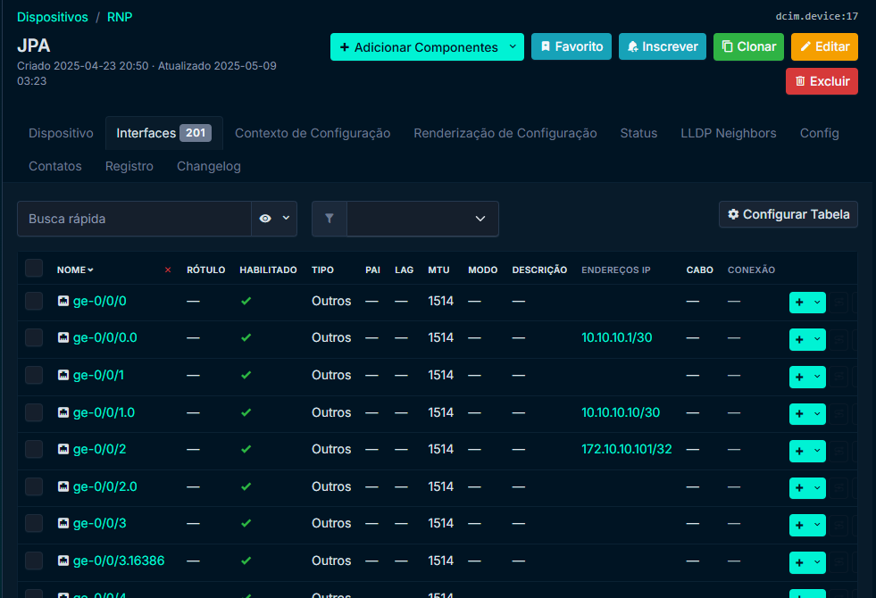

# :material-power-plug-outline: Napalm Plugin

O plugin Napalm para o NetBox permite integrar funcionalidades de coleta em tempo real diretamente dos dispositivos de rede configurados no sistema. Com ele, é possível obter informações atualizadas como status operacional, vizinhanças (LLDP/CDP) e configurações dos equipamentos, enriquecendo a visualização e gestão dos ativos no NetBox. Essa integração torna a ferramenta mais dinâmica, aproximando a documentação da realidade atual da rede.

## :simple-git: Repositório do Plugin
Copie o link abaixo ou clique a seguir para acessar o [Repositório do Github](https://github.com/netbox-community/netbox-napalm-plugin)

```
https://github.com/netbox-community/netbox-napalm-plugin
```

---

## :material-scale-balance: 1. Requisitos para instalação
Esta documentação utilizou os seguintes componentes com suas respectivas versões:

| Componentes           | Versões |
| --------------------- | ------- |
| **Netbox**            | v4.1.11 |
| **Napalm Plugin**     | v0.3.1  |

Na documentação foram testadas as seguintes funcionalidades:

| Funcionalidades         | Funcionando |
| ----------------------- | ----------- |
| **Status Page**         | ✅ |
| **LLDP Neighbors Page** | ✅ |
| **Config Page**         | ✅ |

---

## :material-file-document-arrow-right: 2. Instalando e Configurando o Plugin no Netbox
Para instalarmos o plugin no Netbox, precisamos alterar e adicionar alguns arquivos 
que são responsáveis pela configuração do Netbox.

Os arquivos são:

- `plugin_requirements.txt`.
- `DockerFile-Plugins`.
- `docker-compose.override.yml`.
- `configuration/plugins.py`.

### :fontawesome-solid-gear: 2.1 Configurando a versão do Netbox:

1. Primeiro, vamos clonar o repositório do Netbox:
```bash
git clone -b release https://github.com/netbox-community/netbox-docker.git
```

2. Acesse o diretório clonado:
```bash
cd netbox-docker
```

3. Agora, mude para a release 3.0.0
```bash
git checkout 3.0.0
```
!!! tip "Informação" 
    Alteramos a branch do repositório para termos acesso à versão 4.1.11 do Netbox.

!!! tip "Dica" 
    Todos os comandos abaixos serão executados dentro diretório raiz do netbox `netbox-docker/`.


### :material-text-box: 2.2 plugin_requirements.txt
Este arquivo contém ama lista dos plugins do Netbox (como pacotes Python do PyPO) que devem ser instalados durante a construção da imagem Docker.

Execute o seguinte comando para escrever o pacote dentro do arquivo `plugin_requirements.txt`.

```bash
echo "netbox-napalm-plugin" > plugin_requirements.txt
```

### :material-docker: 2.3 DockerFile-Plugins
Esse é o DockerFile usado para construir a imagem docker customizada.

1. Crie o arquivo e acesse com um editor: 
```bash
nano DockerFile-Plugins
```

2. Copie o conteúdo abaixo e cole no arquivo:
```bash
FROM netboxcommunity/netbox:v4.1

COPY ./plugin_requirements.txt /opt/netbox/
RUN pip install -r /opt/netbox/plugin_requirements.txt
```

### :material-docker: 2.4 docker-compose.override.yml
Como o nome implica, esse arquivo contaim as configurações que vão sobrescrever o `docker-compose.yml`.

Caso você ainda não tenha configurado a rede `br-lab`. Acesse: [Configurando a Rede Docker](../../../../Laboratórios/Juniper/vJunos/Lab%20Descoberta/index.md/#31-configurando-a-rede-docker)

1. Crie o arquivo e acesse com um editor:
```bash
nano docker-compose.override.yml
```

2. Copie o conteúdo abaixo e cole no arquivo:
```bash
services:
  netbox:
    image: netbox:latest-plugins
    pull_policy: never
    ports:
      - 8000:8080
    build:
      context: .
      dockerfile: Dockerfile-Plugins
    networks:
      - br-lab

  netbox-worker:
    image: netbox:latest-plugins
    pull_policy: never
    networks:
      - br-lab

  netbox-housekeeping:
    image: netbox:latest-plugins
    pull_policy: never
    networks:
      - br-lab

  postgres:
    networks:
      - br-lab

  redis:
    networks:
      - br-lab

  redis-cache:
    networks:
      - br-lab

networks:
  br-lab:
    external: true
```

As alterações feitas foram: 

- adicionar o Netbox na rede `br-lab`.
- alteração do dockerfile para o `Dockerfile-Plugins`, criado anteriormente.
- Também alterado a imagem dos serviços para: `netbox:latest-plugins`.

### :material-power-plug-outline: 2.5 plugins.py
Este arquivo é responsável por setar as configurações específicas de cada plugin.

1. Acesse o arquivo com o editor:
```bash
nano configuration/plugins.py
```

2. Copie e cole o conteúdo no arquivo:
```bash
PLUGINS = [
    "netbox_napalm_plugin"
]

PLUGINS_CONFIG = {
    "netbox_napalm_plugin": {
        "NAPALM_USERNAME": "admin", # Usuário para acesso aos equipamentos
        "NAPALM_PASSWORD": "admin@123", # Senha para acesso aos equipamentos
    },
}
```

---

## :simple-docker: 3. Build e Deploy!
Agora seu Netbox está configurado e pronto para o deploy, siga os comandos abaixo e construa a nova instancia do Netbox!

1. Construa a imagem:
```bash
docker compose build --no-cache
```

2. Suba os containeres:
```bash
docker compose up -d
```

Após os containeres subirem, execute os comandos abaixos para copiar os arquivos estáticos solicitados pelo plugin do Napalm.

1. Primeiro, mude as permissões dos arquivos usando o comando abaixo:
```bash
docker compose exec -it --user root netbox chmod -R a+w /opt/netbox/netbox/static
```

2. Então, execute o comando para copiar os arquivo estáticos:
```bash
docker compose exec netbox python3 manage.py collectstatic --noinput
```

---

## :fontawesome-solid-gear: 4. Configurando o Napalm
Agora, com o Netbxo já configurado e funcionando, vamos configurar e entender melhor como o Napalm funciona.

**Pontos importantes, para o ativar o plugin do Napalm precisamos dos seguintes requisitos:**

- Napalm Platform Configs
- Dispositivo
    - Função do Dispositivo (Device role)
    - Tipo do Dispositivo (Device type)
    - Status: Ativo
    - Plataforma (Plataform)
    - IPv4 Primário
    - Interfaces (Para exibir a aba LLDP Neighbors) 

### :material-file: 4.1 Napalm Platform Configs
Acesse seu Netbox e siga as instruções abaixo.

1. No menu lateral, vá em **Plugin** → **Napalm**.
2. Clique no botão **Adicionar**.
3. `Plataform`: Selecione uma plataform (ex: **junos**)
4. `NAPALM driver`: Aqui é o nome do driver usado pelo Napalm para coletar os dados dos dispositivos. Para ver os drivers disponíveis, acesse [Supported Devices](https://napalm.readthedocs.io/en/latest/support/#general-support-matrix). Neste caso vamos usar o **junos**.
5. `NAPALM arguments`(Opcional): Argumentos passados quando inicializa o NAPALM driver. Argumentos em: [Optional Arguments](https://napalm.readthedocs.io/en/latest/support/#optional-arguments). Em nosso caso, não iremos preencher.
6. Clique em **Criar**.

Pronto! agora temos o Plataform Config criado para acesso aos nossos dispositivos! 

### :fontawesome-solid-gears: 4.2 Configurando um Dispositivo
Para testarmos o plugin do Napalm, precisamos de dispositivos para consulta, para isso, vamos usar o laboratório de Descoberta [Mais informações](../../../../Laboratórios/Juniper/vJunos/Lab%20Descoberta/index.md). Logo, adicionar pelo menos um dispositivo ao Netbox.

#### :material-router-wireless: 4.2.1 Adicionando os Roteadores
1. Clone o respositório do laboratório:
```bash
git clone https://git.rnp.br/redes-abertas/labs/-/tree/main/discovery-lab
```

2. Entre no repositório:
```bash
cd discovery-lab/
```

3. Inicie a topologia com o comando:
```bash
sudo clab deploy -t clab/discovery-lab.clab.yaml
```
!!! warning "Debug" 
    Os dispositivos podem levar cerca de 10 minutos para estarem totalmente operacionais.
    Caso ocorra algum erro, verifique a saída do comando para possíveis mensagens de erro. Use `docker logs <container_name>` para depurar.

#### :octicons-diff-added-16: 4.2.2 Adicionando o roteador ao Netbox.
Criar site

1. Vá em **Sites** → clique em **Add**.
2. Preencha os campos:
   - **Name**: `RNP`
3. Clique em **Create**.

---

Criar o Fabricante

1. Vá em **Devices** → **Manufacturers** → **Add**.
2. Preencha:
   - **Name**: `Juniper`
   - **Slug**: `juniper` (ou gerado automaticamente)
3. Clique em **Create**.

---

Criar o Tipo de Dispositivo

1. Vá em **Devices** → **Device Types** → **Add**.
2. Preencha:
   - **Manufacturer**: `Juniper`
   - **Model**: `VMX`
3. Clique em **Create**.

---

Criar o Dispositivo

1. Vá em **Devices** → clique em **Add**.
2. Preencha:
   - **Name**: `JPA`
   - **Device Role**: `Roteador` (crie se necessário)
   - **Device Type**: `VMX`
   - **Site**: `RNP`
   - **Status**: `Active`
3. Clique em **Create**.

---

Criar Interface

1. Acesse o dispositivo `JPA`.
2. Vá na aba **Interfaces** → clique em **Add Interface**.
3. Preencha:
   - **Name**: `ge-0/0/2`
   - **Type**: `Virtual`
4. Clique em **Create**.

---

Criar Endereço IP

1. Vá em **IPAM** → **IP Addresses** → **Add**.
2. Preencha:
   - **Address**: `172.10.10.101/32`
   - **Status**: `Active`
   - **Interface Assignment**:
     - **Device**: `JPA`
     - **Interface**: `ge-0/0/2`
3. Clique em **Create**.

---

Adicionando IPv4 Primário no Dispositivo

1. Vá em **Dispositivos**
2. Clique no **JPA** e depois em **Editar**
3. Em **Gestão** → **IPv4 primário**: Selecione `172.10.10.101/32 (ge-0/0/2)`

---

## :material-eye: 5. Visualizando o Plugin
Após o cadastro, na aba de dispositivos, acesse **JPA**.

Agora você deve estar vendo as abas adicionais do plugin Napalm.

- Status
- LLDP Neighbors
- Config

### :simple-statuspage: 5.1 Status
A aba Status, habilitada por meio da integração do NetBox com o plugin NAPALM, exibe informações operacionais em tempo real do dispositivo de rede. Essa funcionalidade permite ao administrador monitorar rapidamente o estado atual do equipamento sem sair da interface do NetBox.

:material-pin: **Principais Informações Apresentadas**:

- **Device Facts**: Dados básicos e estáticos do dispositivo, como:

    - `Hostname`: Identificação do dispositivo na rede (ex: JPA)

    - `Vendor / Model`: Fabricante e modelo do equipamento (ex: Juniper VMX)

    - `Serial Number`: Número de série do hardware

    - `OS Version`: Versão do sistema operacional (ex: 22.2R1.9)

    - `Uptime`: Tempo desde o último boot, com data e hora registradas

- **Environment**: Métricas ambientais e de desempenho que auxiliam na manutenção preventiva e operação:

    - `CPU Usage`: Utilização atual da(s) CPU(s), apresentada por núcleo

    - `Memory`: Quantidade de memória disponível e utilizada

    - `Temperature, Fans, Power (PSUs)`: Status dos sensores e fontes de energia (caso o equipamento forneça esses dados)


:simple-target: **Finalidade**: 

Essa aba é especialmente útil para diagnóstico rápido, auditorias, e monitoramento da saúde dos dispositivos, eliminando a necessidade de login manual via SSH ou console. As informações são atualizadas dinamicamente por meio da API do NAPALM, desde que corretamente configurada no NetBox.

### :material-connection: 5.2 LLDP Neighbors
Esta funcionalidade exibe os vizinhos de camada 2 detectados por meio do protocolo LLDP (Link Layer Discovery Protocol). Essa funcionalidade permite identificar automaticamente os dispositivos conectados diretamente ao equipamento monitorado.

:material-pin: **Comportamento Importante**:

- A visualização de vizinhos está limitada às interfaces previamente cadastradas no NetBox.

- Caso uma interface exista no dispositivo real, mas não tenha sido criada no NetBox, os vizinhos descobertos por ela não serão exibidos.



:simple-target: **Finalidade**:

Essa aba é útil para validar conexões físicas entre dispositivos, verificar a topologia de rede em tempo real e detectar erros de cabeamento ou configuração de portas, de forma automatizada e integrada à interface do NetBox.

### :fontawesome-solid-gear: 5.3 Config
A aba Config, permite a visualização direta das configurações do dispositivo de rede, extraídas remotamente por meio da API. Ela apresenta diferentes versões do arquivo de configuração, úteis para comparação, auditoria e troubleshooting.

:material-file: **Tipos de Configurações Exibidas**:

- `Startup Config`: A configuração que será carregada quando o dispositivo for reiniciado. Representa o estado persistente.

- `Running Config`: A configuração atualmente em execução no dispositivo. Pode incluir mudanças não salvas.

- `Candidate Config` (quando suportada pelo sistema operacional): Configuração em edição que ainda não foi aplicada. Presente em equipamentos que trabalham com staging de configurações (ex: Juniper).


:simple-target: **Finalidade**:

Essa aba é essencial para o gerenciamento e rastreamento de mudanças na configuração dos dispositivos, além de fornecer uma forma prática e segura de validar se as configurações persistentes estão de acordo com as em execução — tudo dentro da interface do NetBox.